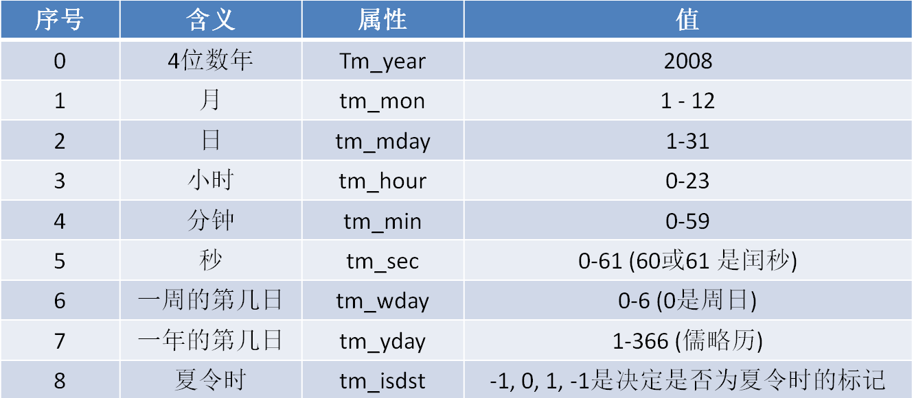

# 01 time模块学习

## 1  功能：提供了处理时间和表示之间进行转换的功能

## 2 获取时间戳

### 2.1 概念

#### 2.1.1 说明

1. 概念：时间戳是指从0时区的1970年1月1 日0时0分0秒，到所给定日期时间的秒数
2. 是一个浮点数

### 2.2 为什么要用到 时间戳

#### 说明：因为很多操作都需要时间戳这种形式，所以需要学习时间戳格式

### 2.3  获取方式

示例代码

```python
import time

# 获取当前的时间戳
now_time = time.time()

# 进行验证一下-现在是2022年 - 一年大概365天，每天都是24小时每小时60分钟每分钟60秒
years = now_time / (24 * 60 * 60 * 365) + 1970
print(years)  # 2022.6975097291415  -- 还是听准确的

```

## 3 时间元组

### 3.1 概念：时间元组是一个存储时间信息的9个数字的元组

### 3.2 时间元组存储的信息

### 3.3 示例

语法：

```python
"""
time 
def localtime(secs: float | None = ...)  -- 参数就是时间戳，浮点值
-> struct_time - 返回时间元组
localtime([seconds]) -> (tm_year,tm_mon,tm_mday,tm_hour,tm_min,
tm_sec,tm_wday,tm_yday,tm_isdst)
Convert seconds since the Epoch to a time tuple expressing local time. When 'seconds' is not passed in, convert the current time instead.
不提供参数时，默认转换当前的时间戳
"""
```


```python
import time

# 获取当前的时间元组信息
now_time = time.localtime()
print(type(now_time))  # <class 'time.struct_time'>
print(now_time)
"""
# time.struct_time(tm_year=2022, tm_mon=8, tm_mday=30, tm_hour=22, tm_min=20, tm_sec=38, tm_wday=1, tm_yday=242, tm_isdst=0)
对时间元组的解读：
    2022-8-30-22-20-38-Tuesday-242
"""
# 示例 将当前时间戳的前一天，转换为时间元组
yesterday_time = time.time() - 24 * 60 * 60

# 使用time.localtime()转化为昨天的时间元组
yesterday_struct = time.localtime(yesterday_time)
print(yesterday_struct) 
"""
time.struct_time(tm_year=2022, tm_mon=8, tm_mday=29, tm_hour=22, tm_min=27, tm_sec=8, tm_wday=0, tm_yday=241, tm_isdst=0)
"""

```

## 4 获取格式化时间-容易阅读的时间格式

### 4.1 将时间戳格式化时间-time.ctime()

#### 4.1.1 语法

```python
"""
time 
def ctime(secs: float | None = ...) -> str 
ctime(seconds) -> string - 返回一个字符串
Convert a time in seconds since the Epoch to a string in local time. This is equivalent to asctime(localtime(seconds)). When the time tuple is not present, current time as returned by localtime() is used
当没有时间元组时，这相当于 asctime(localtime(seconds))。
"""
```


#### 4.1.2 示例

```python
import time

# 1. 将时间戳格式化时间  ctime()
now_time = time.time()

now = time.ctime(now_time)
print(now)  # Tue Aug 30 22:54:51 2022
# 不提供参数给ctime()
now = time.ctime()
print(now)  # Tue Aug 30 22:54:51 2022

```


### 4.2 将时间元组格式化时间-time.asctime()

#### 4.2.1 语法

```python
"""
time def asctime(t: Tuple[int, int, int, int, int, int, int, int, int] | struct_time = ...)
  -> str - 返回一个字符串格式
asctime([tuple]) -> string
Convert a time tuple to a string, e.g. 'Sat Jun 06 16:26:11 1998'. 
When the time tuple is not present, current time as returned by localtime() is used
默认使用localtime()提供的当前的时间元组信息
"""
```

#### 4.2.2 示例

```python
now_struct_time = time.localtime()
now = time.asctime(now_struct_time)
print(now)  # Tue Aug 30 22:56:33 2022

# 不提供任何参数给asctime()
now_time = time.asctime()
print(now_time)  # Tue Aug 30 23:02:28 2022
```

## 5. 时间元组<->格式化时间转换

### 5 .0  常用格式符

详见菜鸟学习-Python3[日期和时间](https://www.runoob.com/python3/python3-date-time.html)

### 5.1  时间元组转化格式化时间 strftime()方法

#### 5.1.1 语法

```python
"""f strftime(format: str, - 时间字符串格式符
             t: Tuple[int, int, int, int, int, int, int, int, int] | struct_time = ...) - 时间元组
  -> str - 返回一个字符串格式的时间字符串
 """
```

#### 5.1.2 示例

```python
import time
now_time_str = time.strftime("%Y-%m-%d %H:%M:%S", time.localtime())
print(now_time_str)  # 2022-08-30 23:25:04

# 常用格式符
# %X-表示本地的时间表示
local_time = time.strftime("%X", time.localtime())
print(local_time)  # 23:27:35
#  %x-表示本地的时间表示
local_time = time.strftime("%x", time.localtime())
print(local_time)  # 08/30/22

# %c - 表示本地的相应的日期表示和时间表示 - 类似于 asctime()
local_time = time.strftime("%c", time.localtime())
print(local_time)  # Tue Aug 30 23:30:41 2022

```

### 5.2 格式化时间字符串-转时间元组（struct_time）

#### 5.2.1 语法 -  time.srtptime()

```python
"""
time 
def strptime(string: str,
             format: str = ...) -> struct_time
strptime(string, format) -> struct_time
"""
```


##### 5.2.2 示例

```python
import time

# 将格式化字符串转化为时间元组 time.strptime()

time_str = "2022-08-30 22:30:53"
struct_time1 = time.strptime(time_str, "%Y-%m-%d %H:%M:%S")
print(struct_time1)
"""
time.struct_time(tm_year=2022, tm_mon=8, tm_mday=30, tm_hour=22, tm_min=30, tm_sec=53, tm_wday=1, tm_yday=242, tm_isdst=-1)
"""
```

### 5.3 编程实现-==将"09-02-2018 02:06:00" 转换为 "2018-09-02 02:06:00"==

```python
old_time_str = "09-02-2018 02:06:00"
# 首先转化为时间元组
old_struct_time = time.strptime(old_time_str, "%m-%d-%Y %H:%M:%S")
print(old_struct_time)
# 时间元组转化为时间格式字符串
new_time_str = time.strftime("%Y-%m-%d %H:%M:%S", old_struct_time)
print(new_time_str)  # 2018-09-02 02:06:00


```

## 6 时间元组转时间戳 - time.mktime()

### 6.1 语法

```python
"""
time def mktime(t: Tuple[int, int, int, int, int, int, int, int, int] | struct_time)
  -> float
mktime(tuple) -> floating point numbe  -  将时间元组-》为时间戳
"""
```

### 6.2 示例

```python
time_str = "2022-08-30 22:30:53"
struct_time1 = time.strptime(time_str, "%Y-%m-%d %H:%M:%S")
now_seconds = time.mktime(struct_time1)
print(now_seconds)  # 1661869853.0
```

## 7 计算程序运行的时间 - time.process_time()

### 示例

```python
import time

# time.process_time()
"""
time 
def process_time() -> float
process_time() -> float
Process time for profiling: sum of the kernel and user-space CPU time.
"""
start = time.process_time()
for i in range(1, 1000000):
    print(i)
end = time.process_time()

run_time = end - start
print(run_time)  # 4.796875

```

## 8 程序暂停运行- time.sleep()

### 8.1 语法

```python
"""
time 
def sleep(secs: float) - 可以是浮点数
 -> None  - 没有返回值
sleep(seconds)
Delay execution for a given number of seconds. The argument may be a floating point number for subsecond precis
延迟运行
"""
```


### 8.2 示例

```python
import time
for i in range(1,10):
    print(f'{i}秒经过')
    time.sleep(1)
```

